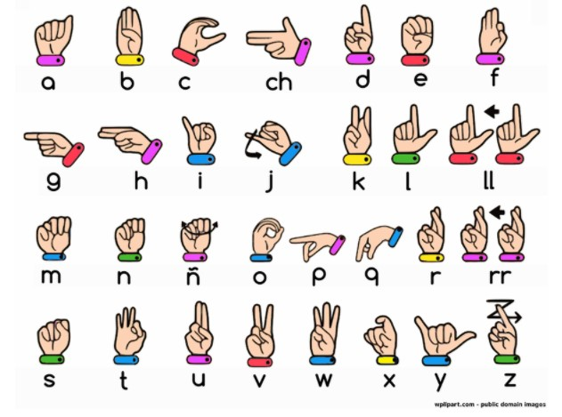

---

# Hand Gesture Recognition

### Hand Gesture to Text – Voice for the Voiceless

This project is a **real-time Hand Gesture Recognition system** that detects **American Sign Language (ASL) alphabets** using a webcam and converts them into **text output**.

The main goal of this project is to help **people who cannot speak or hear communicate with others** using hand gestures. The system captures hand movements, processes them using **computer vision and deep learning**, and predicts the corresponding alphabet.

---
<p align="center">
  
</p>
# Project Overview

Many people with speech disabilities rely on **sign language** to communicate. However, most people around them do not understand sign language.

This project attempts to reduce that communication gap by creating a system that can:

* Detect hand gestures using a webcam
* Recognize the corresponding alphabet
* Display the detected alphabet on screen

The detected alphabet is shown on a **white card with prediction confidence** so the user can easily see the output.

---

# Features

* User **Login and Registration System**
* **Real-time webcam hand detection**
* **Hand skeleton visualization**
* **Deep learning based gesture classification**
* **Prediction confidence indicator**
* **Stabilized predictions using frame buffer**
* **ASL alphabet reference guide**

---

# Technologies Used

### Programming Language

Python

### Libraries and Tools

* Streamlit
* TensorFlow / Keras
* OpenCV
* MediaPipe
* CVZone
* NumPy
* YAML
* Matplotlib
* Scikit-learn

These tools are used for **hand detection, image processing, and gesture classification**.

---

# System Requirements

### Hardware

* Webcam
* Minimum 8 GB RAM recommended

### Software

* Python **3.10 recommended**
* pip package manager

---

# Project Structure

```
Hand-Gesture-Recognition
│
├── app.py
├── gesture_model_finetuned2.keras
├── reference.jpg
├── users.yaml
├── requirements.txt
└── README.md
```

---

# Download Trained Model

The trained model file is too large to upload directly to GitHub.

Please download the trained model from the link below and place it inside the project folder.

Download Model:
[gesture_model_finetuned2.keras](https://drive.google.com/file/d/1NzlZbpuYE6pvX43onBqvivoaoZLjUDXp/view?usp=sharing)

File name should be:

```
gesture_model_finetuned2.keras
```

---

# Installation

Clone the repository:

```
git clone https://github.com/prachi-ankush-3/Hand-Gesture-Recognition.git
cd Hand-Gesture-Recognition
```

Install required libraries:

```
pip install streamlit
pip install tensorflow
pip install opencv-python
pip install mediapipe
pip install cvzone
pip install numpy
pip install matplotlib
pip install scikit-learn
pip install pyyaml
```

Or install using requirements file:

```
pip install -r requirements.txt
```

---

# How to Run the Project

Run the Streamlit application:

```
streamlit run app.py
```

After running the command, the application will open in the browser at:

```
http://localhost:8501
```

Login or register to access the gesture recognition system.

---

# How the System Works

1. The webcam captures the user's hand gesture.
2. MediaPipe detects the **hand landmarks**.
3. The landmarks are converted into a **skeleton representation**.
4. The skeleton image is passed to the **trained deep learning model**.
5. The model predicts the **ASL alphabet**.
6. The detected alphabet is displayed on the screen with prediction confidence.

To improve accuracy, the system uses a **frame buffer technique** which stabilizes predictions across multiple frames.

---

# Purpose of the Project

The main purpose of this project is to **use technology for social good**.

It aims to support **people with speech disabilities** by providing a tool that can convert their hand gestures into readable text.

This can make communication easier in daily life situations.

---

# Future Enhancements

This project can be extended with several improvements:

**1. Alphabet to Word Conversion**
Detected alphabets can be combined to form complete words.

Example:
H + E + L + L + O → HELLO

**2. Text to Speech Conversion**
The generated text can be converted into **voice output** so that others can hear the message.

**3. Sentence Formation**
Continuous gesture recognition can be used to generate complete sentences.

**4. Mobile Application**
The system can be converted into a **mobile application** for easier accessibility.

**5. More Gesture Support**
Support for numbers, words, and additional sign language gestures can be added.

---

# Author

Prachi Ankush


